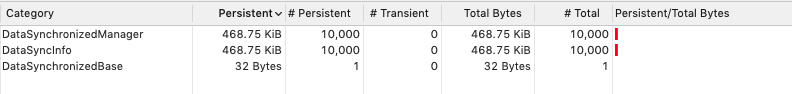
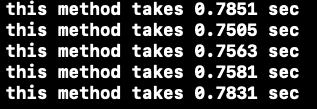

# DataSynchronized

a solution for iOS data synchronization

iOS开发本地数据同步的解决方案

## What for

实现本地数据双向绑定，修改一处数据，其他数据自动同步的功能。主要解决有数据同步需求但采用Notification不易于开发和维护，重新拉取网络数据不方便（比如有分页）且有延时的问题.

##Featured

* 一行代码调用，数据一处修改，其他绑定数据自动同步
* 内存占用小，绑定耗时短
* 采用kvo实现，但调用者无需关心内存以及监听的释放
* 内存依赖于绑定的model，model dealloc时自动释放内存和监听移除
* 数据路径加载采用kvc实现，支持多级路径
* 支持同种数据绑定，不同种数据映射绑定

## How To Use

* clone并将```DataSync```文件夹拖入项目

* 在需要绑定数据处```import DataSynchronized.h```

* 调用
  * 同种数据类型

  ```objective-c
  //在获取到数据后进行数据源绑定,如果有多个字段用逗号间隔,支持多级路径
      __weak typeof(self)weakSelf = self;
      [_data addDataSynchronizedKeyPath:@"isFollow,myName,otherModel.otherName" IDPath:@"myID" onChange:^(MyModel *  _Nonnull model) {
          //数据改变回调,在此处执行UI操作
          [weakSelf.tableView reloadData];
      }];
      return _data;
  ```
    * 不同数据类型

  ```objective-c
      /*
       把data绑定到MyModel类上
       data.otherName与MyModel.myName绑定
       将data.othrID作为绑定的改变标识符
       */
      [_data bindingDataSynchronizedTo:MyModel.class keyPaths:@{@"myName":@"otherName"} IDPath:@"otherID" onChange:^(OtherModel * _Nonnull model) {
          //数据改变回调,在此处执行UI操作
          weakSelf.textField.text = model.otherName;
      }];
      return _data;
  ```
  <div  align="center">    
  
  </div>

## Profile
### 内存

该库在绑定数据时维护一个静态类，为每个绑定数据生成一个内存管理对象:```DataSynchronizedManager```和一个数据同步Info:```DataSyncInfo``` 每个大小为48bytes，绑定10000条数据绑定理论消耗额外内存936KB



### 耗时

time profile环境为iPhone5s (iOS12.0)
5次同时为10000条数据进行绑定耗时数据




